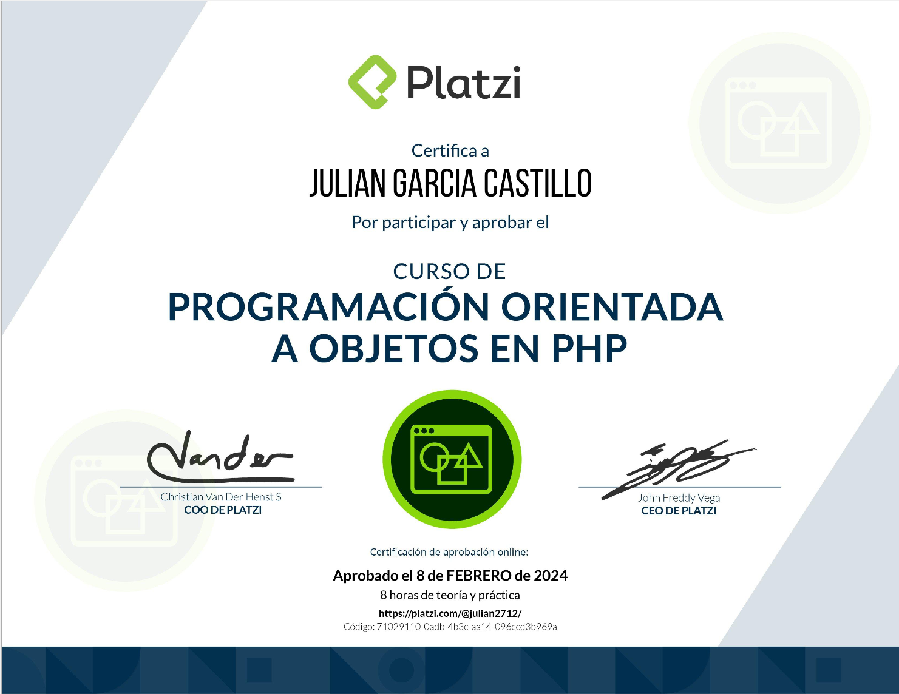

## Ruta PHP
### Curso 7

# Descripción
La programación orientada a objetos o POO es el paradigma de programación más popular y adoptado por PHP gracias a su flexibilidad para adaptarse a cualquier proyecto y permitir su escalabilidad. Aprende a implementar cada una de las características que ofrece esta forma de programar para desarrollar aplicaciones increíbles con código limpio y siguiendo buenas prácticas.
